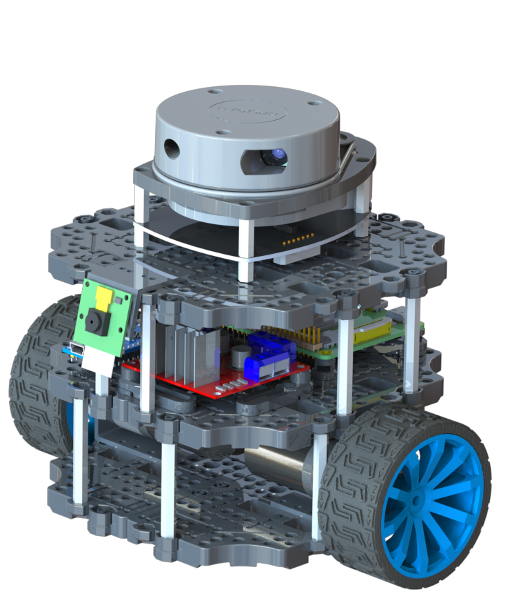
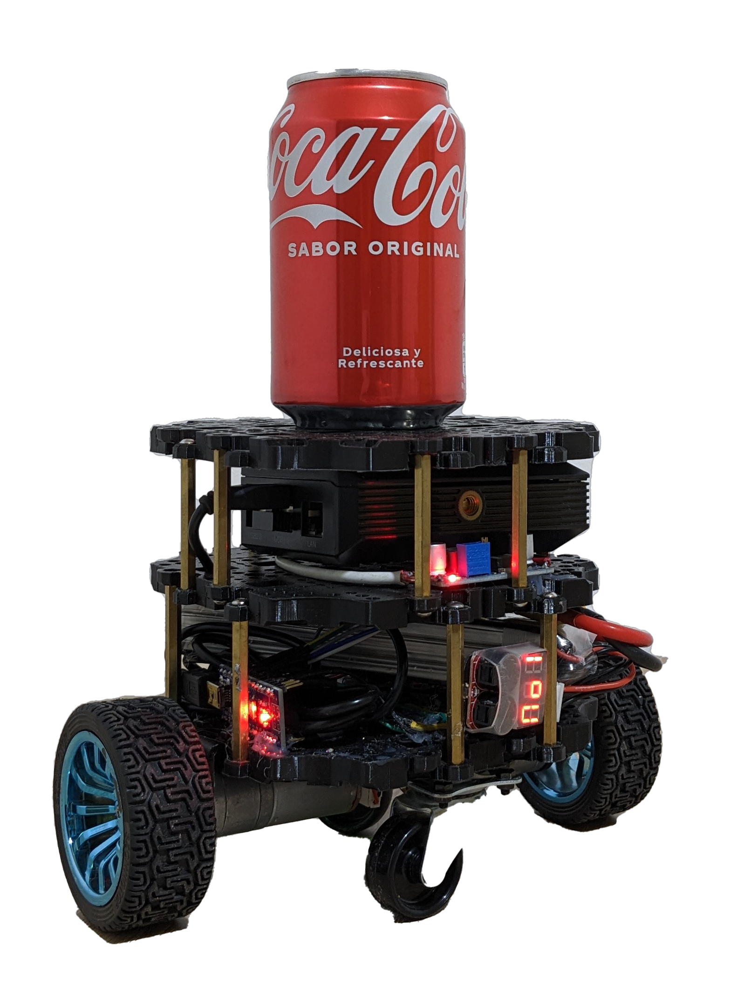

[![LinkedIn][linkedin-shield]][linkedin-url]
[![Udemy][udemy-shield]][udemy-url]

<p align="center">
  
</p>

Bumperbot is an open-source 3D printed self-driving robot powered by ROS 2. Its simple design and low cost make it an excellent learning platform, featured in the following online courses:
* [Self Driving and ROS 2 - Learn by Doing! Odometry & Control
](https://www.udemy.com/course/self-driving-and-ros-2-learn-by-doing-odometry-control/?referralCode=50BCC4E84DB2DB09BFB3)
* [Self Driving and ROS 2 - Learn by Doing! Map & Localization
](https://www.udemy.com/course/self-driving-and-ros-2-learn-by-doing-map-localization/?referralCode=8FC4AC725C57F7A93F79)

## :robot: Features

- :rocket: [`bumperbot_bringup`](./bumperbot_bringup): Contains launch files that starts all the functionalities of the real or simulated robot.
- :video_game: [`bumperbot_controller`](./bumperbot_controller): Contains the [ROS 2 Control](https://control.ros.org/rolling/index.html) configuration and Hardware interface with the real robot.
- :paperclip: [`bumperbot_cpp_examples`](./bumperbot_cpp_examples): Contains ROS 2 templates for developing with C++.
- :ledger: [`bumperbot_description`](./bumperbot_description): Contains the URDF description of the robot and its Gazebo simulation.
- :battery: [`bumperbot_firmware`](./bumperbot_firmware): Contains the Arduino code for actuating the motors of the real robot.
- :car: [`bumperbot_hardware`](./bumperbot_hardware): Contains the CAD model of the robot along with the STL files for 3D printing the robot.
- :pushpin: [`bumperbot_localization`](./bumperbot_localization): Contains the Odometry calculation using the [robot_localization](https://docs.ros.org/en/melodic/api/robot_localization/html/index.html) package and the Global Localization configuration and launch files for [Nav2 AMCL](https://docs.nav2.org/configuration/packages/configuring-amcl.html).
- :world_map: [`bumperbot_mapping`](./bumperbot_mapping): Contains an implementation of the Mapping with known poses algorithm and the [SLAM Toolbox](https://github.com/SteveMacenski/slam_toolbox) configuration and launch files
- :email: [`bumperbot_msgs`](./bumperbot_msgs/): Contains the definition of new ROS 2 message interfaces.
- :paperclip: [`bumperbot_py_examples`](./bumperbot_py_examples/): Contains ROS 2 templates for developing with Python.
- :hammer_and_pick: [`bumperbot_utils`](./bumperbot_utils/): Contains some utilities and tools.

## :building_construction: Usage

This robot and its simulation can be used with an Ubuntu 22.04 machine running ROS 2 Humble or and Ubuntu 24.04 machine running ROS 2 Jazzy.

### Prerequisites

* Install [Ubuntu 24.04](https://ubuntu.com/download/desktop) or [Ubuntu 22.04](https://releases.ubuntu.com/jammy/) on your PC or in a Virtual Machine.
* Install [ROS 2 Jazzy](https://docs.ros.org/en/jazzy/Installation/Ubuntu-Install-Debians.html) if you are on Ubuntu 24.04. Otherwise, install [ROS 2 Humble](https://docs.ros.org/en/jazzy/Installation/Ubuntu-Install-Debians.html) if you are on Ubuntu 22.04
* Install ROS 2 missing libraries. Some libraries that are used in this project are not in the standard ROS 2 package. Install them with:
* Install [VS Code](https://code.visualstudio.com/) and [Arduino IDE](https://docs.arduino.cc/software/ide-v2/tutorials/getting-started/ide-v2-downloading-and-installing/) on your PC in order to build and load the Arduino code on the device
* Install Python and C++ addistional libraries
```sh
sudo apt-get update && sudo apt-get install -y \
     libserial-dev \
     python3-pip
```

```sh
pip install pyserial
```

### Installation

1. Create a Workspace
```sh
mkdir -p bumperbot/src
```

2. Clone this repo
```sh
cd bumperbot_ws/src
git clone https://github.com/AntoBrandi/Bumper-Bot.git
```

3. Install the dependencies
```sh
cd ..
rosdep install --from-paths src --ignore-src -i -y
```

4. Build the workspace
```sh
colcon build
```

5. Source the ROS Workspace (Use this command in a separate terminal from the one you used to build the workspace)
```sh
. install/setup.bash
```

#### :computer: Simulation

6. Launch all the functionalities for the simulated robot
```sh
ros2 launch bumperbot_bringup simulated_robot.launch.py
```

#### :mechanical_arm: Real Robot

7. Connect the Arduino actuating your robot to your PC and load the [robot_control.ino](./bumperbot_firmware/firmware/robot_control/robot_control.ino) script using the Arduino IDE.

8. Launch all the functionalities for the real robot
```sh
ros2 launch bumperbot_bringup real_robot.launch.py
```

## :selfie: Media

<p align="center">
  
</p>

https://github.com/user-attachments/assets/6a461f72-1dae-4d4d-a8a7-a8a9c1fe127b

https://github.com/user-attachments/assets/a2ec2818-2296-45db-a49b-5c32240cd7d5

https://github.com/user-attachments/assets/122f02ca-ccb7-421f-bb53-b94aba00624b


## :raised_hands: Contributing

Contributions are what make the open source community such an amazing place to be learn, inspire, and create. Any contributions you make are **greatly appreciated**.
Please refer to [CONTRIBUTING](CONTRIBUTING.md) doc.

## :star2: Acknowledgements
* [Turtlebot 3 Burger](https://emanual.robotis.com/docs/en/platform/turtlebot3/overview/)

## :link: Contact

Antonio Brandi - [LinkedIn]([linkedin-url]) - antonio.brandi@outlook.it

Other Projects: [https://github.com/AntoBrandi](https://github.com/AntoBrandi)


[linkedin-shield]: https://img.shields.io/badge/-LinkedIn-black.svg?style=flat-square&logo=linkedin&colorB=555
[linkedin-url]: https://www.linkedin.com/in/antonio-brandi-512166bb/
[udemy-shield]: https://img.shields.io/badge/-Udemy-black.svg?style=flat-square&logo=udemy&colorB=555
[udemy-url]: https://www.udemy.com/course/self-driving-and-ros-2-learn-by-doing-odometry-control/?referralCode=50BCC4E84DB2DB09BFB3
